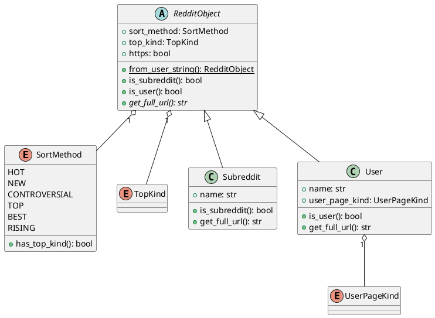

```plantuml
@startuml
enum    SortMethod
enum    TopKind
enum    UserPageKind
abstract class   RedditObject
class   Subreddit
class   User

SortMethod : HOT
SortMethod : NEW
SortMethod : CONTROVERSIAL
SortMethod : TOP
SortMethod : BEST
SortMethod : RISING
SortMethod : +has_top_kind(): bool

RedditObject <|-- User
RedditObject <|-- Subreddit

RedditObject "1" o-- SortMethod
RedditObject "1" o-- TopKind
User "1" o-- UserPageKind

RedditObject : +sort_method: SortMethod
RedditObject : +top_kind: TopKind
RedditObject : +https: bool
RedditObject : {static} +from_user_string(): RedditObject
RedditObject : +is_subreddit(): bool
RedditObject : +is_user(): bool
RedditObject : {abstract} +get_full_url(): str

Subreddit : +name: str
Subreddit : +is_subreddit(): bool
Subreddit : +get_full_url(): str

User : +name: str
User : +user_page_kind: UserPageKind
User : +is_user(): bool
User : +get_full_url(): str
@enduml
```